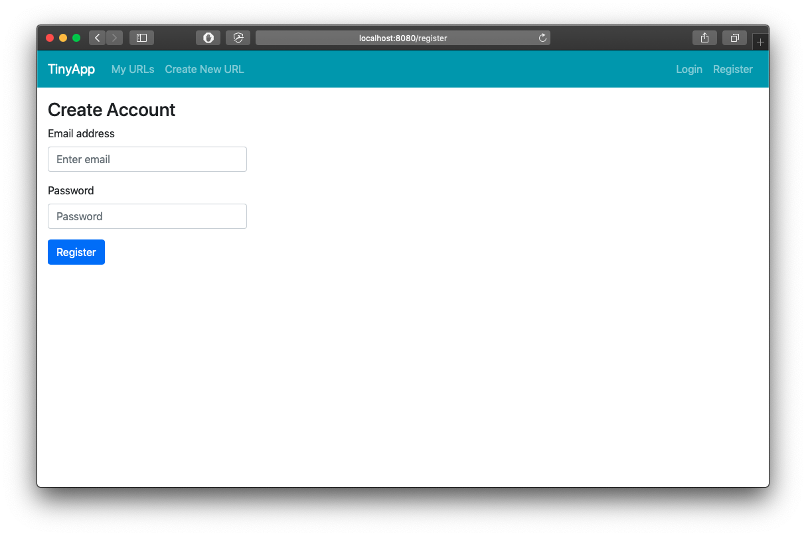
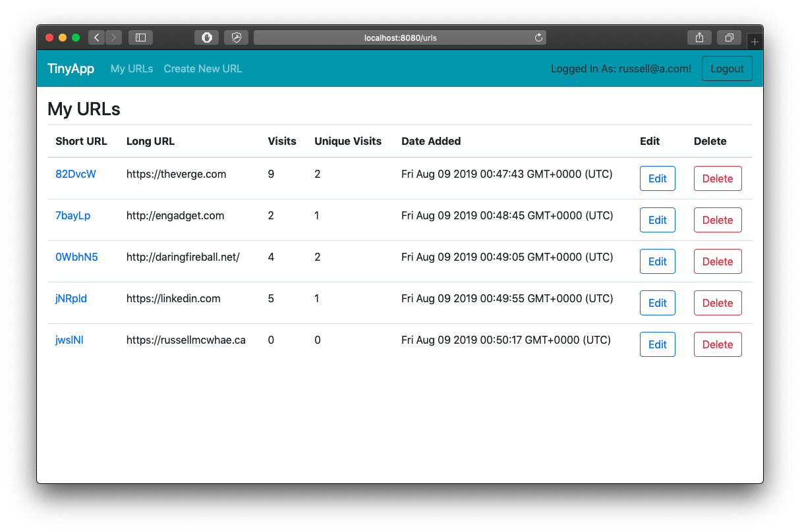
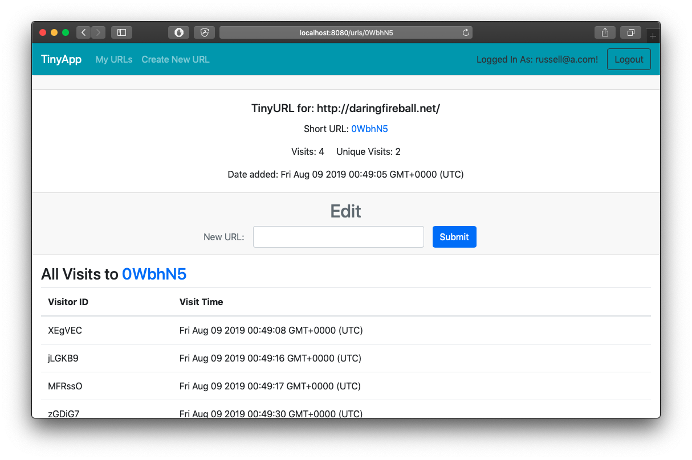

# TinyApp Project

TinyApp is a full-stack web application built with Node.js and Express that allows users to shorten long URLs (à la bit.ly). Created during the Lighthouse Lab Calgary Web Development Boot Camp in August 2019.

## Final Product

### Register Page

### List of Saved URLs

### A Single URL

## Dependencies

- Node.js
- Express
- EJS
- bcrypt
- body-parser
- cookie-parser
- cookie-session
- method-override

## Getting Started

- Install all dependencies (using the `npm install` command).
- Run the development web server using the `node express_server.js` command. Alternatively, install [nodemon](https://nodemon.io/) then run `npm start` to avoid manually restarting the server every time you modify express_server.js
- Visit http://localhost:8080/ in your preferred web browser